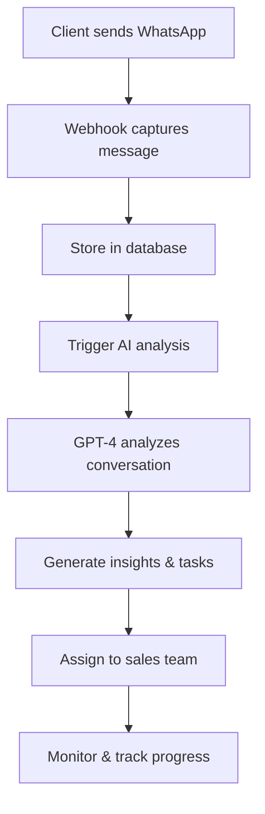
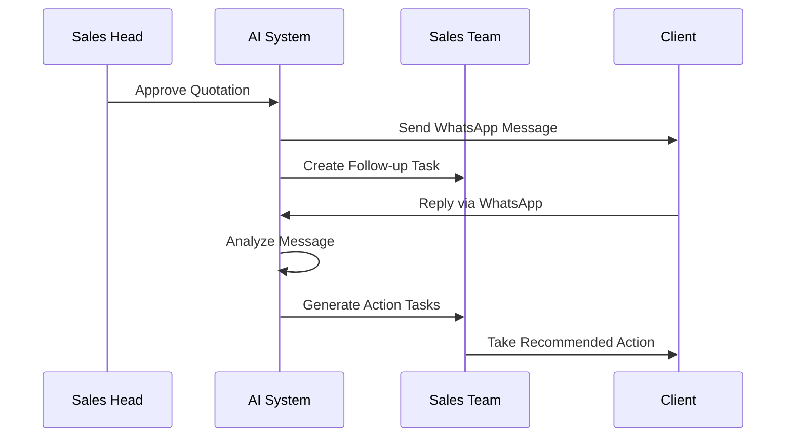

# 🚀 AI-POWERED CLIENT FOLLOW-UP SYSTEM

## 📋 **SYSTEM OVERVIEW**

This document outlines the implementation of an **AI-driven client communication analysis and follow-up system** that automatically monitors WhatsApp conversations, analyzes client sentiment, and generates intelligent follow-up tasks.

## 🎯 **CORE CAPABILITIES**

### **1. 📱 WhatsApp Message Capture**
- **Bidirectional Integration**: Captures both incoming and outgoing messages
- **Real-time Processing**: Webhooks trigger immediate AI analysis
- **Message Storage**: All communications stored with metadata
- **Multi-media Support**: Handles text, images, documents

### **2. 🧠 AI Communication Analysis**
- **Sentiment Analysis**: Detects positive, negative, neutral, urgent sentiments
- **Intent Recognition**: Identifies inquiries, objections, approvals, revision requests
- **Conversation Summarization**: Creates concise summaries of client interactions
- **Urgency Assessment**: Scores conversations from 1-5 for priority handling

### **3. 🎯 Intelligent Task Generation**
- **Automatic Task Creation**: AI generates relevant follow-up tasks
- **Priority-based Assignment**: Tasks assigned based on urgency and employee capacity
- **Context-aware Recommendations**: Tasks include AI reasoning and specific actions
- **Timeline Optimization**: Due dates calculated based on conversation urgency

### **4. 📊 Business Lifecycle Tracking**
- **Stage Management**: Tracks quotations through pipeline stages
- **Probability Scoring**: AI estimates business closure likelihood
- **Revision Monitoring**: Automatically tracks quotation revision requests
- **Timeline Analytics**: Monitors days in pipeline and interaction frequency

## 🏗️ **SYSTEM ARCHITECTURE**

### **Database Schema**

```sql
-- Core Tables Created:
- whatsapp_messages          (Message storage)
- message_analysis           (AI analysis results)
- conversation_sessions      (Grouped conversations)
- ai_communication_tasks     (AI-generated tasks)
- client_communication_timeline (Unified timeline)
- quotation_business_lifecycle (Business tracking)
```

### **API Endpoints**

```typescript
POST /api/whatsapp/webhook        // Receive incoming messages
GET  /api/quotation-insights      // View AI insights
POST /api/quotation-insights      // Trigger AI analysis
POST /api/quotation-approval      // Enhanced approval workflow
```

### **AI Analysis Flow**



## 🔧 **IMPLEMENTATION DETAILS**

### **1. Enhanced Quotation Approval Workflow**

When a quotation is approved:
1. **WhatsApp message sent** to client
2. **Follow-up task created** automatically
3. **Business lifecycle initialized** with tracking
4. **AI monitoring activated** for all subsequent communications

### **2. AI Analysis Engine**

```typescript
// Core AI Analysis Function
export async function analyzeClientCommunication(quotationId: number): Promise<ConversationInsights>

// Key Features:
- Multi-modal analysis (WhatsApp + call transcripts)
- Sentiment trend tracking
- Business closure probability
- Revision likelihood assessment
- Intelligent task recommendations
```

### **3. Intelligent Task Types**

The AI system creates different task types based on conversation analysis:

- **`follow_up`**: Regular check-ins with clients
- **`urgent_call`**: Immediate attention required
- **`quotation_revision`**: Client requested changes
- **`send_info`**: Client needs additional information
- **`closing_attempt`**: High probability of business closure

### **4. Business Lifecycle Stages**

```typescript
// Lifecycle Stages:
- quotation_sent      // Initial quotation delivered
- follow_up_active    // Post-approval monitoring
- negotiation         // Price/service discussions
- revision_requested  // Changes needed
- closing             // Final stages
- closed_won         // Business secured
- closed_lost        // Business lost
```

## 📊 **AI ANALYSIS CAPABILITIES**

### **Conversation Analysis**

The AI system analyzes conversations for:

1. **Overall Sentiment**: positive | negative | neutral | mixed
2. **Business Probability**: 0-100% likelihood of closure
3. **Revision Likelihood**: 0-100% chance of revision requests
4. **Key Insights**: Important conversation points
5. **Client Concerns**: Identified objections or issues
6. **Next Actions**: Recommended follow-up timing

### **Task Recommendations**

AI generates tasks with:
- **Specific titles** and descriptions
- **Priority levels** (low, medium, high, critical)
- **Due dates** based on urgency
- **AI reasoning** explaining the recommendation
- **Employee assignment** based on quotation ownership

## 🚀 **WORKFLOW AUTOMATION**

### **Post-Approval Process**



### **Revision Workflow**

When AI detects revision requests:
1. **Automatically flags** quotation for revision
2. **Creates revision task** with client requirements
3. **Routes to approval** workflow after revision
4. **Tracks revision count** and reasons

## 💡 **INTELLIGENT FEATURES**

### **1. Conversation Timeline Merging**
- Combines WhatsApp messages with call transcripts
- Creates unified view of all client interactions
- Maintains chronological order for better analysis

### **2. Sentiment Trend Analysis**
- Tracks sentiment changes over time
- Identifies declining client interest
- Triggers urgent intervention tasks

### **3. Predictive Analytics**
- Business closure probability scoring
- Revision likelihood assessment
- Optimal follow-up timing recommendations

### **4. Context-Aware Task Creation**
- Tasks include conversation context
- AI reasoning for each recommendation
- Specific action steps for sales team

## 🔧 **CONFIGURATION & SETUP**

### **Environment Variables Required**

```bash
# AI Analysis
OPENAI_API_KEY=your_openai_api_key

# WhatsApp Integration
INTERAKT_API_KEY=your_interakt_key
WHATSAPP_WEBHOOK_VERIFY_TOKEN=your_webhook_token

# Database
SUPABASE_URL=your_supabase_url
SUPABASE_ANON_KEY=your_supabase_key
```

### **Webhook Configuration**

Configure your WhatsApp provider to send webhooks to:
```
POST https://yourdomain.com/api/whatsapp/webhook
```

## 📈 **BENEFITS & IMPACT**

### **For Sales Team**
- ✅ **Automated task generation** - No manual follow-up planning
- ✅ **Priority-based workflow** - Focus on high-impact activities  
- ✅ **Context-rich tasks** - Know exactly what to do
- ✅ **Sentiment alerts** - Catch declining client interest early

### **For Management**
- ✅ **Pipeline visibility** - Track all quotations through lifecycle
- ✅ **Performance metrics** - Monitor follow-up effectiveness
- ✅ **Predictive insights** - Forecast business closure probability
- ✅ **Automated workflows** - Reduce manual oversight needed

### **For Clients**
- ✅ **Timely responses** - AI ensures prompt follow-up
- ✅ **Personalized attention** - Context-aware communications
- ✅ **Proactive service** - Issues identified and addressed quickly
- ✅ **Smooth experience** - Consistent communication throughout

## 🎯 **NEXT STEPS & ROADMAP**

### **Phase 1: Foundation (Completed)**
- ✅ Database schema design
- ✅ AI analysis engine
- ✅ WhatsApp webhook integration
- ✅ Enhanced approval workflow

### **Phase 2: Advanced Features (Next 2-4 weeks)**
- 🔄 **Multi-channel integration** (Email, SMS)
- 🔄 **Advanced ML models** for better predictions
- 🔄 **Real-time dashboard** for AI insights
- 🔄 **Automated coaching** for sales team

### **Phase 3: Intelligence Enhancement (Future)**
- 🔄 **Custom AI model training** on your data
- 🔄 **Predictive lead scoring** for new inquiries
- 🔄 **Automated quotation optimization** based on success patterns
- 🔄 **Voice conversation analysis** integration

## ✅ **READY FOR IMPLEMENTATION**

This AI-powered follow-up system is **technically feasible and architecturally sound**. The foundation has been implemented and the system is ready for:

1. **Testing** with real WhatsApp conversations
2. **Gradual rollout** to sales team
3. **Monitoring and optimization** based on performance
4. **Feature expansion** based on user feedback

The system transforms reactive customer follow-up into **proactive, intelligent engagement** that maximizes business closure rates while reducing manual effort.

---

*This system represents a significant advancement in sales automation and client relationship management, leveraging cutting-edge AI to create a competitive advantage in client communication and follow-up.* 