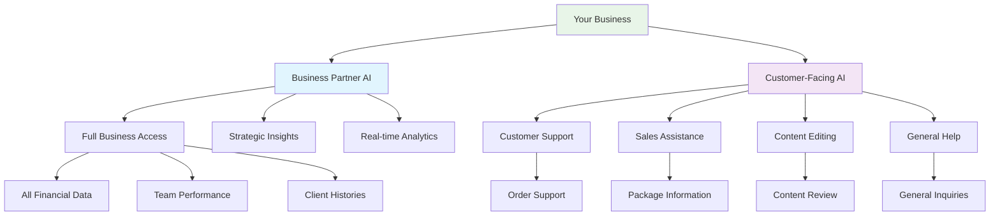

# 🤖 Dual AI System Architecture

## Overview
Your business now has **TWO DISTINCT AI SYSTEMS** designed for different purposes and audiences:

### 1. 🎯 **BUSINESS PARTNER AI** (Internal Use)
**Location**: `/sales/ai-insights` → AI Chat tab  
**API**: `/api/ai-simple-chat`  
**Purpose**: Your strategic business co-founder

### 2. 🤝 **CUSTOMER-FACING AI** (External Use)  
**API**: `/api/customer-ai-chat`  
**Purpose**: Professional customer support/sales/editor

---

## 🎯 Business Partner AI

### **Personality & Approach**
- **Role**: Strategic business co-founder who knows everything
- **Communication**: Direct, peer-level, strategic thinking
- **Access**: Complete business data, financials, client histories
- **Tone**: "Let's discuss our business strategy"

### **Key Features**
```typescript
🎯 STRATEGIC THINKING: Always thinks 2-3 steps ahead
📊 DATA-DRIVEN: References specific numbers, clients, trends  
💡 SOLUTION-FOCUSED: Identifies problems + proposes solutions
🤝 PEER-LEVEL: Talks as equal business partner
📈 GROWTH-MINDED: Looks for revenue opportunities
```

### **Knowledge Depth**
- Every client's status, preferences, and history
- Photography business model and pricing strategy
- Cash flow, conversion rates, team performance
- Client behavior patterns and seasonal trends
- Which clients need follow-ups and why

### **Business Intelligence Context**
```typescript
💼 BUSINESS HEALTH SCORE: 🟢 STRONG (67.5% conversion)
💰 CASH FLOW: ₹2,50,000 total revenue from 3 quotes
🎯 KEY OPPORTUNITIES: 1 pending quote worth ₹50,000
⚠️ ACTION REQUIRED: 0 overdue follow-ups, 0 approvals pending
📈 GROWTH INDICATORS: 1 active leads, 100.0% lead conversion
🏆 TOP PERFORMER: Vikas Alagarsamy handling 2 active quotes
```

### **Sample Conversation**
```
YOU: "How's our conversion rate looking?"

BUSINESS AI: "We're at 67.5% conversion - that's solid. Jothi Alagarsamy's ₹50k quote is still pending response since November. I'd suggest following up this week since it's been sitting for a while. 

Also noticed we have strong lead conversion at 100%, but only 1 active lead. We should focus on lead generation - maybe Instagram ads targeting the areas where our existing clients came from?"
```

---

## 🤝 Customer-Facing AI

### **Personality & Approach**
- **Role**: Professional representative of your business
- **Communication**: Warm, helpful, professional
- **Access**: Limited to customer-relevant information only
- **Tone**: "How can I help you today?"

### **Security Features**
- ❌ **NO ACCESS** to internal financials, team details, business strategy
- ❌ **NO SHARING** of other customers' information
- ✅ **ONLY** customer service and general business information

### **Four Specialized Contexts**

#### 1. **Support Mode** (`context_type: 'support'`)
```typescript
CUSTOMER SUPPORT ROLE:
- Help with orders, quotations, and services
- Provide information about photography packages
- Assist with scheduling and booking
- Handle complaints with empathy
- Escalate complex issues to humans
```

#### 2. **Sales Mode** (`context_type: 'sales'`)
```typescript
SALES REPRESENTATIVE ROLE:
- Present photography services professionally
- Understand customer needs and suggest solutions
- Provide general pricing information
- Guide through inquiry and booking process
- Focus on customer benefits (not pushy)
```

#### 3. **Editor Mode** (`context_type: 'editor'`)
```typescript
CONTENT EDITOR ROLE:
- Review and improve customer communications
- Ensure professional, error-free content
- Maintain brand voice and consistency
- Suggest improvements for clarity
- Respect customer's original intent
```

#### 4. **General Mode** (`context_type: 'general'`)
```typescript
GENERAL ASSISTANT ROLE:
- Provide helpful business information
- Answer common photography questions
- Direct to appropriate resources
- Maintain professional communication
```

### **API Usage Examples**

#### Customer Support
```bash
POST /api/customer-ai-chat
{
  "message": "I haven't received my photos yet",
  "customer_name": "Ramya",
  "context_type": "support"
}
```

#### Sales Inquiry
```bash
POST /api/customer-ai-chat
{
  "message": "What photography packages do you offer for weddings?",
  "context_type": "sales"
}
```

#### Content Editing
```bash
POST /api/customer-ai-chat
{
  "message": "Please review this: 'we wants to book photography for our event'",
  "context_type": "editor"
}
```

---

## 🔒 Security & Data Protection

### **Business Partner AI**
- ✅ **Full Access**: All business data, financials, strategy
- ✅ **Real-time Data**: Live business intelligence
- ✅ **Strategic Context**: Growth opportunities, performance metrics
- 🔒 **Internal Only**: Never exposed to customers

### **Customer-Facing AI**
- ❌ **No Internal Data**: No financial details, team info, strategy
- ✅ **Customer Context**: Limited to their own quotation history
- ✅ **Professional Boundaries**: Appropriate customer service limits
- 🌐 **External Safe**: Can be exposed to customers

---

## 🚀 Implementation Status

### ✅ **COMPLETED**
- [x] Business Partner AI with strategic personality
- [x] Customer-facing AI with 4 context modes
- [x] Anti-hallucination system
- [x] Database-driven configuration
- [x] Real-time business intelligence
- [x] Secure data separation

### 🎯 **READY TO USE**
1. **Business Partner AI**: Already working at `/sales/ai-insights`
2. **Customer AI**: API ready at `/api/customer-ai-chat`

---

## 🎯 Next Steps

### **For Business Partner AI** (Already Working)
- Test strategic conversations
- Ask about specific clients
- Request business insights
- Discuss growth strategies

### **For Customer-Facing AI** (Ready to Deploy)
- Integrate into customer website/portal
- Add to WhatsApp Business API
- Create customer chat widget
- Set up multi-context routing

---

## 🔄 **The Two-AI Ecosystem**



**Your AI partnership is now fully operational! 🚀** 