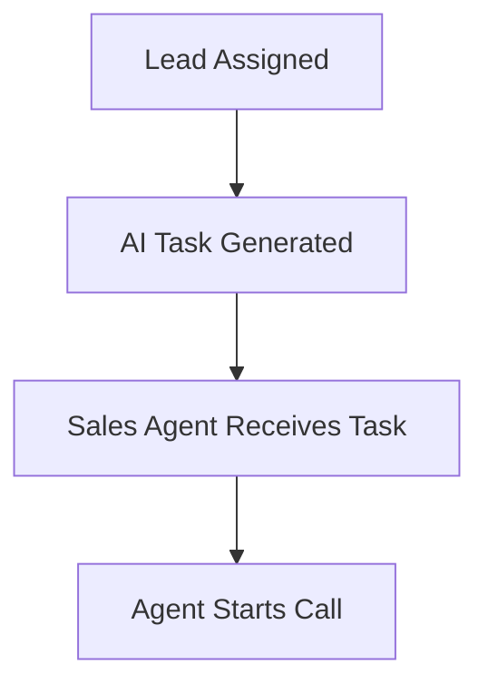
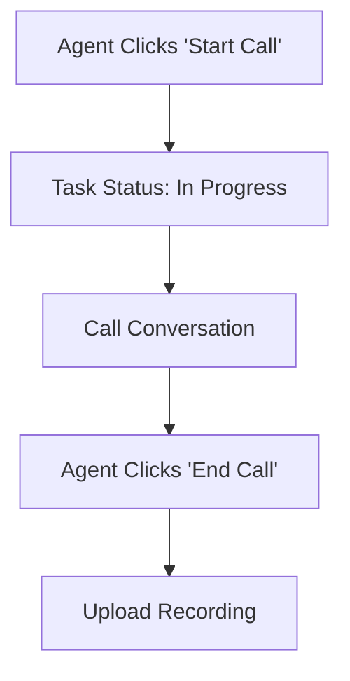
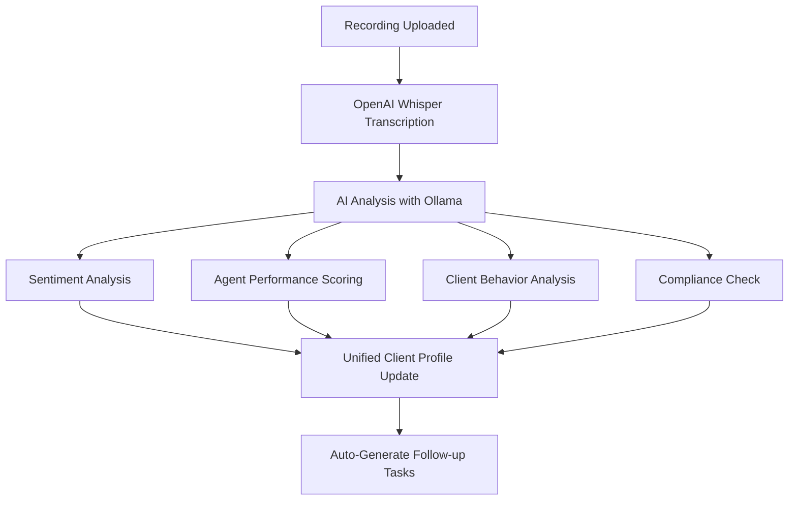

# 📞 **COMPLETE CALL ANALYTICS & TRANSCRIPTION SYSTEM**

## 🎯 **SYSTEM OVERVIEW**

This comprehensive system transforms your existing task management into a powerful call analytics platform with:

- **Automatic Call Transcription** using OpenAI Whisper
- **AI-Powered Sentiment Analysis** with Ollama LLM
- **Sales Performance Analytics** with agent scoring
- **Client Behavior Analysis** with buying signals detection
- **Compliance Monitoring** with forbidden words detection
- **Unified Client Profiles** across all communication channels
- **Automated Follow-up Task Generation** based on call outcomes

---

## 🔄 **COMPLETE WORKFLOW**

### **1. LEAD ASSIGNMENT → TASK CREATION**


### **2. CALL EXECUTION & RECORDING**


### **3. TRANSCRIPTION & ANALYTICS**


---

## 📊 **ANALYTICS FEATURES**

### **🎭 SENTIMENT ANALYSIS**
- **Overall Sentiment**: Positive/Negative/Neutral (-1.0 to +1.0)
- **Client Sentiment**: How the client feels during the call
- **Agent Sentiment**: How the agent comes across
- **Real-time Trend Tracking**: Monitor sentiment changes over time

### **👨‍💼 AGENT PERFORMANCE SCORING (1-10)**
- **Professionalism Score**: Courtesy, language, expertise demonstration
- **Responsiveness Score**: Answer quality, speed, relevance
- **Knowledge Score**: Product knowledge, accurate information
- **Closing Effectiveness**: Next steps, commitment securing

### **👥 CLIENT BEHAVIOR ANALYSIS**
- **Engagement Level**: High/Medium/Low client participation
- **Interest Level**: Measured buying intent
- **Buying Signals**: Detected positive indicators
- **Objection Handling**: Identified concerns and how they were addressed

### **⚠️ COMPLIANCE MONITORING**
- **Forbidden Words Detection**: Inappropriate language, false promises
- **Risk Level Assessment**: Low/Medium/High compliance risk
- **Compliance Issues**: Specific problems identified
- **Regulatory Adherence**: Industry standards compliance

### **🧠 BUSINESS INTELLIGENCE**
- **Quote Discussion**: Was pricing discussed?
- **Budget Mentioned**: Did client reveal budget?
- **Timeline Discussion**: Project timeline clarity
- **Next Steps Agreed**: Clear follow-up actions
- **Follow-up Required**: Auto-determined need for follow-up

---

## 🔧 **SYSTEM COMPONENTS**

### **1. ENHANCED CALL ANALYTICS SERVICE** (`services/call-analytics-service.ts`)
```typescript
// Core Features:
- OpenAI Whisper Integration for transcription
- Ollama LLM for sentiment and behavioral analysis
- Comprehensive scoring algorithms
- Automated insights generation
- Follow-up task creation
```

### **2. DATABASE SCHEMA** (`database/call-analytics-schema.sql`)
```sql
-- Tables Created:
- call_transcriptions (stores call recordings and transcripts)
- call_analytics (stores AI analysis results)
- call_insights (stores business intelligence)

-- Views Created:
- call_analytics_summary (unified call data view)
- agent_performance_summary (agent metrics)
- client_interaction_summary (client journey tracking)
```

### **3. CALL INTEGRATION API** (`app/api/tasks/call-integration/route.ts`)
```typescript
// Endpoints:
POST /api/tasks/call-integration
- start_call: Mark call as started
- end_call: Complete call and calculate duration
- upload_recording: Process audio file with analytics

GET /api/tasks/call-integration?task_id=xxx
- Get call integration status for any task
```

### **4. ENHANCED WEBHOOK** (`app/api/webhooks/calls/route.ts`)
```typescript
// Supports Multiple Formats:
- Recording URL (direct audio file links)
- Structured Call Data (metadata + recording)
- Pre-transcribed Calls (text + metadata)
- Audio File Upload (direct file upload)
```

### **5. CALL ANALYTICS DASHBOARD** (`app/(protected)/tasks/dashboard/call-analytics-page.tsx`)
```typescript
// Features:
- Real-time task status with call integration
- Comprehensive analytics visualization
- Agent performance tracking
- Client behavior insights
- Risk management dashboard
```

---

## 🚀 **IMPLEMENTATION STEPS**

### **Step 1: Database Setup**
```bash
# Run the database migration
psql -h your-host -d your-database -f database/call-analytics-schema.sql
```

### **Step 2: Environment Variables**
```bash
# Add to .env.local
OPENAI_API_KEY=your_openai_api_key_here
```

### **Step 3: Access the Dashboard**
```
Navigate to: /tasks/dashboard/call-analytics-page
```

### **Step 4: Test the Workflow**
1. Assign a lead to create a task
2. Go to Call Analytics Dashboard
3. Click "Start Call" on a task
4. Make the actual call
5. Click "End Call"
6. Upload the recording
7. View automatic analytics generated

---

## 📱 **INTEGRATION POINTS**

### **🔗 WhatsApp Integration**
- Existing WhatsApp conversations automatically linked to client profiles
- Call analytics enhances WhatsApp conversation insights

### **🎯 Task Management Integration**
- All existing task functionality preserved
- Enhanced with call tracking and analytics
- Automated follow-up task generation

### **📊 Universal Business Intelligence**
- Call data feeds into existing BI system
- Unified client profiles across all channels
- Enhanced reporting and insights

---

## 📞 **WEBHOOK INTEGRATION EXAMPLES**

### **1. External Call Recording Service**
```javascript
// Post to your webhook when call ends
fetch('https://api.ooak.photography/api/webhooks/calls', {
  method: 'POST',
  headers: { 'Content-Type': 'application/json' },
  body: JSON.stringify({
    recording_url: 'https://recordings.service.com/call_123.mp3',
    call_id: 'call_123',
    from: '+919876543210',
    to: '+919677362524',
    duration: 420,
    timestamp: '2024-01-01T10:30:00Z',
    client_name: 'Priya Sharma',
    sales_agent: 'Vikas Alagarsamy'
  })
})
```

### **2. Manual Recording Upload**
```javascript
// Upload audio file directly
const formData = new FormData()
formData.append('audio_file', audioFile)
formData.append('call_id', 'manual_123')
formData.append('client_name', 'Rajesh Kumar')
formData.append('sales_agent', 'Vikas Alagarsamy')

fetch('https://api.ooak.photography/api/webhooks/calls', {
  method: 'POST',
  body: formData
})
```

### **3. Task Integration**
```javascript
// Start call from task
fetch('https://api.ooak.photography/api/tasks/call-integration', {
  method: 'POST',
  headers: { 'Content-Type': 'application/json' },
  body: JSON.stringify({
    task_id: 'task_456',
    action: 'start_call',
    call_data: {
      agent_name: 'Vikas Alagarsamy',
      client_name: 'Priya Sharma'
    }
  })
})
```

---

## 📈 **BUSINESS IMPACT**

### **📊 IMMEDIATE BENEFITS**
- **100% Call Documentation**: Every client interaction recorded and analyzed
- **Objective Performance Metrics**: Data-driven agent evaluation
- **Proactive Risk Management**: Compliance issues detected automatically
- **Enhanced Client Experience**: Better understanding of client needs
- **Automated Follow-ups**: No leads slip through cracks

### **💰 REVENUE IMPACT**
- **Improved Conversion Rates**: Better sales techniques through analytics
- **Faster Response Times**: Automated follow-up task generation
- **Higher Client Satisfaction**: Personalized approach based on call insights
- **Reduced Compliance Risk**: Automatic detection of issues
- **Better Deal Closure**: Next steps clearly identified and tracked

### **🎯 COMPETITIVE ADVANTAGE**
- **Professional Service**: Systematic approach to client communication
- **Data-Driven Decisions**: Insights-based business strategy
- **Consistent Quality**: Standardized call handling and follow-up
- **Scalable Process**: System handles growth automatically
- **Client Trust**: Transparent and systematic approach

---

## 🔧 **CUSTOMIZATION OPTIONS**

### **📝 Custom Analysis Prompts**
Modify the AI analysis in `services/call-analytics-service.ts`:
```typescript
private buildAnalysisPrompt(transcription: CallTranscription): string {
  return `
    // Add your custom analysis requirements here
    // Modify scoring criteria
    // Add industry-specific compliance checks
  `
}
```

### **🎯 Custom Follow-up Rules**
Enhance follow-up logic in `triggerFollowUpActions()`:
```typescript
// Add custom follow-up conditions
if (analytics.custom_condition) {
  followUpTasks.push({
    // Custom task configuration
  })
}
```

### **📊 Custom Dashboards**
Extend the dashboard with custom views:
```typescript
// Add custom tabs, filters, and visualizations
// Integrate with your existing reporting tools
```

---

## 🚨 **TROUBLESHOOTING**

### **Common Issues:**

1. **Transcription Fails**
   - Check OpenAI API key
   - Verify audio file format
   - Check file size limits

2. **Analytics Not Generated**
   - Verify Ollama is running on localhost:11434
   - Check model availability (llama3.1:8b)
   - Review prompt formatting

3. **Tasks Not Updated**
   - Check Supabase connection
   - Verify table permissions
   - Review API endpoint responses

### **Debug Commands:**
```bash
# Check Ollama status
curl http://localhost:11434/api/tags

# Test transcription endpoint
curl -X POST /api/webhooks/calls -d '{"test": true}'

# Check database tables
SELECT * FROM call_transcriptions LIMIT 5;
```

---

## 🎉 **SUCCESS METRICS**

Track these KPIs to measure system effectiveness:

- **Call Analytics Coverage**: % of calls with full analytics
- **Response Time**: Average time from call to follow-up task
- **Sentiment Trends**: Client satisfaction over time
- **Agent Performance**: Individual and team improvements
- **Conversion Rates**: Before/after system implementation
- **Compliance Score**: Risk reduction metrics

---

## 🔮 **FUTURE ENHANCEMENTS**

### **Planned Features:**
- **Real-time Transcription**: Live call monitoring
- **Advanced Voice Analytics**: Tone, pace, emotional analysis
- **Predictive Analytics**: Conversion probability scoring
- **Integration with CRM**: Automatic data sync
- **Mobile App**: Call analytics on mobile devices
- **Multi-language Support**: Support for regional languages

### **Integration Roadmap:**
- **Calendar Integration**: Automatic call scheduling
- **Email Integration**: Follow-up email generation
- **Payment Integration**: Quote-to-payment automation
- **Video Call Support**: Zoom/Teams integration
- **Social Media**: LinkedIn/Facebook lead integration

---

This system provides the foundation for a world-class client communication and analytics platform that will significantly enhance your business operations and client relationships! 🚀 